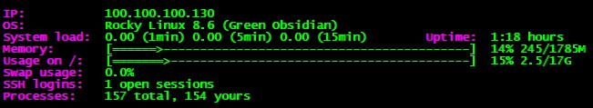

# Login information Script on Rocky Linux

<p align="center">

</p>

1. Copy `Login-info-RockyLinux.sh` file in `/etc/profile.d`

2. Set `755` or `777` permission to `Login-info-RockyLinux.sh`
```bash script
cd /etc/profile.d
chmod 755 Login-info-RockyLinux.sh

```
3. Logout and login again then enjoy the information :ok_hand:
